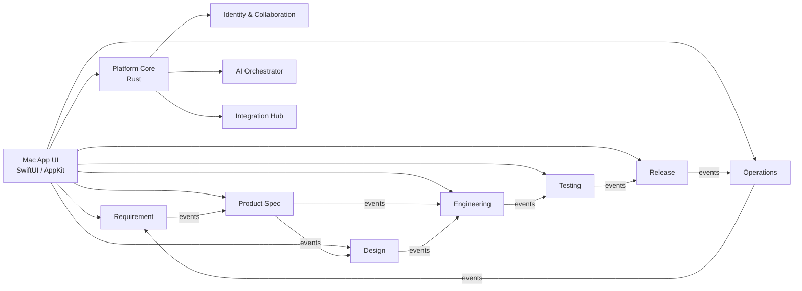
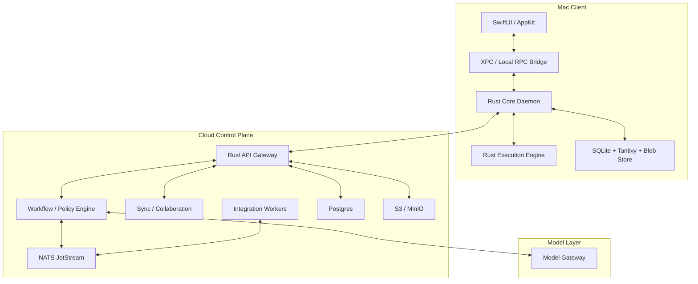
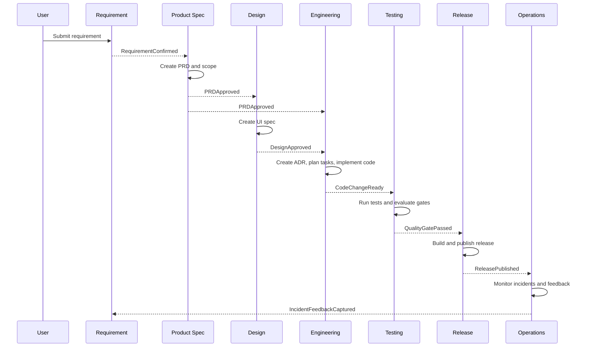

# System Blueprint v0.1

## 1. System Goal

Build a macOS-native software delivery operating system for the full lifecycle of software development:

- requirement collection
- PRD authoring
- UI specification and design review
- architecture and technical decisions
- task planning
- code generation and implementation
- testing and quality gates
- release and rollback
- maintenance, alerting, and incident feedback

The system is not a chat app with AI attached. It is a structured execution system whose outputs must remain traceable from requirement to release.

## 2. Architecture Principles

1. `System of record is structured artifacts, not chat history.`
2. `All state changes are evented and auditable.`
3. `UI never performs heavy execution directly.`
4. `Each domain owns its own model and write path.`
5. `Cross-domain coordination happens through commands, domain events, and read models.`
6. `Local-first by default, cloud-assisted for collaboration and governance.`
7. `AI can suggest and generate, but cannot bypass domain ownership or approval gates.`

## 3. Top-Level Context Map

## 4. Runtime Topology

## 5. Layer Responsibilities

### 5.1 Mac UI

- native windows, navigation, inspector, command palette, diff views
- document browsing and approvals
- task monitoring and execution visibility
- zero heavy business logic

### 5.2 Platform Core

- event log
- artifact graph
- local projections
- local search index
- sync client
- job scheduler
- policy evaluation hooks

### 5.3 Execution Engine

- git worktree lifecycle
- code generation workspace
- build, test, lint, package, release commands
- sandboxed runner and log capture

### 5.4 Cloud Control Plane

- identity, permissions, approvals
- cross-device sync
- team collaboration
- org-level policies
- async jobs and integration webhooks

### 5.5 Model Gateway

- model routing
- prompt/template versioning
- structured output validation
- fallback and retry policy

## 6. Core Storage Strategy

### 6.1 Local Storage

- `SQLite`
  - event log
  - materialized read models
  - sync checkpoints
  - local job queue
- `Tantivy`
  - full-text search
  - filtered retrieval
- `Blob Store`
  - design images
  - generated docs
  - build artifacts
  - test reports

### 6.2 Cloud Storage

- `Postgres`
  - org/project/workspace state
  - approvals
  - collaboration state
  - event registry and projections
- `Object Storage`
  - binary assets and build outputs
- `NATS JetStream`
  - async events
  - retryable integration workflows

## 7. Key Decoupling Rules

1. A domain may only write its own aggregates.
2. A domain may read another domain only through:
   - published events
   - approved read models
   - explicit query contracts
3. No module may directly mutate another module's tables or projections.
4. AI output is always a proposal until accepted by a domain command.
5. Execution results become facts only after being persisted as events.

## 8. Primary Business Flow

## 9. Non-Functional Targets

The exact numbers can change later, but the architecture should be designed around these targets:

- local command response for common UI actions: `p95 < 100 ms`
- local search response on medium project metadata: `p95 < 150 ms`
- opening a structured artifact: `p95 < 200 ms`
- background event ingestion should not block UI thread
- sync conflicts must be explainable and recoverable
- local daemon crash must not corrupt the event log
- any accepted artifact must remain traceable to its origin

## 10. Architectural Decision

The first implementation should be a `modular monolith` in Rust for the core and cloud layers, not microservices.

Reason:

- domain boundaries are still stabilizing
- cross-domain workflows are central
- operational simplicity matters
- performance and correctness matter more than early distribution

The architecture should preserve extraction seams so that individual domains can later be moved into separate services if real scaling pressure appears.
