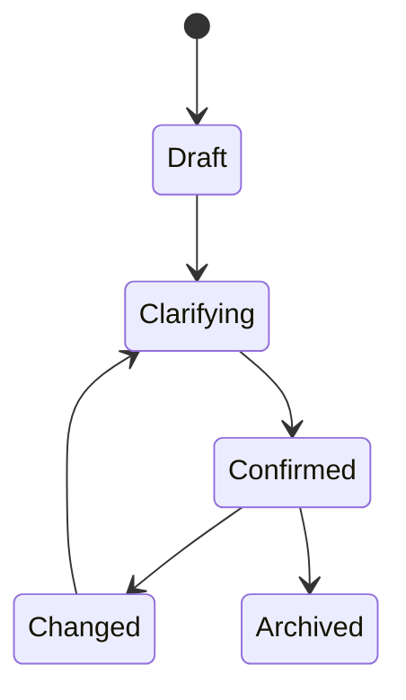
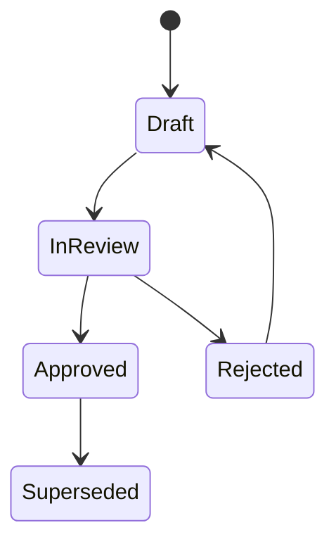
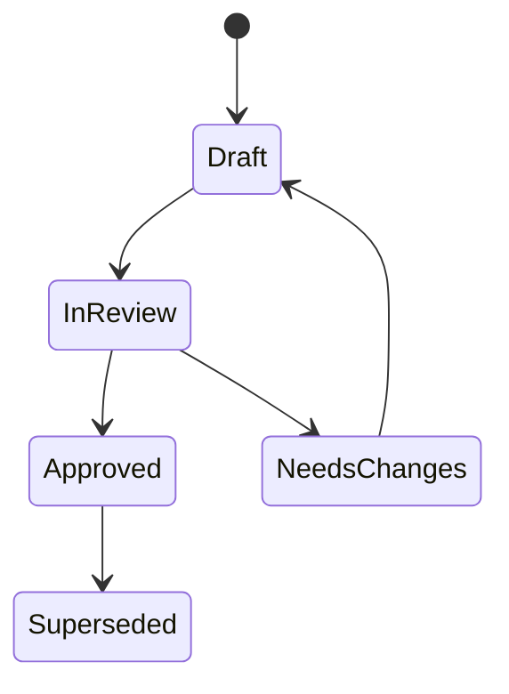
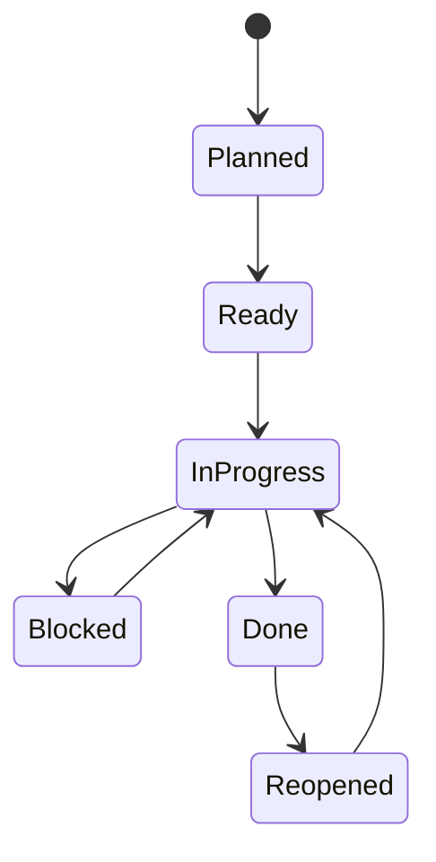
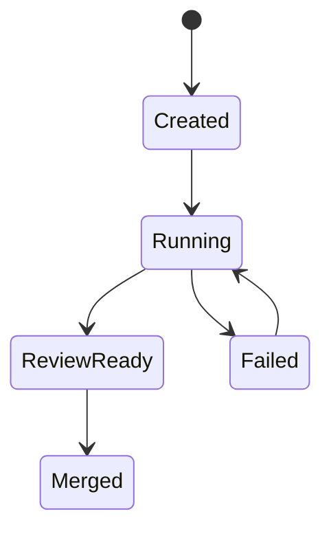
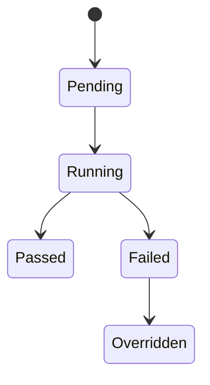
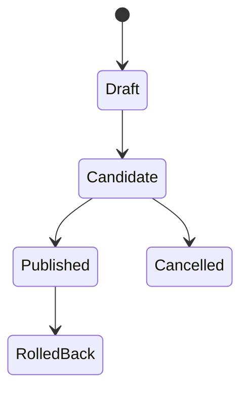
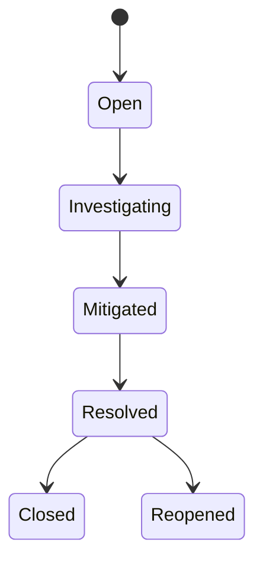

# Core Domain Model v0.1

## 1. Modeling Principles

1. Each bounded context owns its own aggregates.
2. Each aggregate has one authoritative write path.
3. Artifact relationships are represented explicitly, not inferred from free text.
4. State transitions must be validated by domain rules, not UI behavior.
5. Every cross-context handoff must be backed by domain events.

## 2. Shared Backbone: Artifact Graph

The shared backbone is not a shared business domain. It is a technical substrate.

### Core Records

- `Artifact`
  - `artifact_id`
  - `artifact_type`
  - `workspace_id`
  - `project_id`
  - `owner_context`
  - `current_version_id`
  - `status`
  - `created_at`
  - `updated_at`
- `ArtifactVersion`
  - `version_id`
  - `artifact_id`
  - `schema_version`
  - `payload_ref`
  - `created_by`
  - `created_at`
- `ArtifactEdge`
  - `edge_id`
  - `from_artifact_id`
  - `to_artifact_id`
  - `edge_type`
  - `created_at`
- `DomainEvent`
  - `event_id`
  - `aggregate_type`
  - `aggregate_id`
  - `event_type`
  - `event_version`
  - `payload`
  - `causation_id`
  - `correlation_id`
  - `occurred_at`

### Standard Edge Types

- `derived_from`
- `clarifies`
- `supersedes`
- `implements`
- `validates`
- `blocks`
- `fixes`
- `released_in`
- `caused_by`

## 3. Bounded Contexts

## 3.1 Requirement Context

### Purpose

Capture raw user intent, resolve ambiguity, and normalize it into a requirement that downstream domains can trust.

### Primary Aggregates

- `Requirement`
  - `requirement_id`
  - `title`
  - `problem_statement`
  - `business_goal`
  - `constraints`
  - `priority`
  - `status`
  - `source_channel`
- `InterviewSession`
  - `session_id`
  - `requirement_id`
  - `messages`
  - `open_questions`
  - `resolved_questions`

### Requirement States

### Domain Rule

A requirement cannot be marked `Confirmed` while critical ambiguity remains unresolved.

## 3.2 Product Spec Context

### Purpose

Turn confirmed requirements into scope, PRD artifacts, and acceptance criteria.

### Primary Aggregates

- `PRD`
  - `prd_id`
  - `requirement_id`
  - `summary`
  - `goals`
  - `non_goals`
  - `scope_version`
  - `status`
- `ScopeItem`
  - `scope_item_id`
  - `prd_id`
  - `name`
  - `category`
  - `priority`
  - `status`
- `AcceptanceCriteria`
  - `criteria_id`
  - `scope_item_id`
  - `statement`
  - `criticality`

### PRD States

### Domain Rule

Only an `Approved` PRD can trigger design or engineering planning.

## 3.3 Design Context

### Purpose

Convert approved scope into UI flows, screens, interaction rules, and visual specifications.

### Primary Aggregates

- `DesignSpec`
  - `design_spec_id`
  - `prd_id`
  - `design_system_ref`
  - `status`
- `UIScreen`
  - `screen_id`
  - `design_spec_id`
  - `name`
  - `platform`
  - `state_count`
- `InteractionFlow`
  - `flow_id`
  - `design_spec_id`
  - `entry_point`
  - `steps`

### Design States

### Domain Rule

UI-affecting engineering work must reference an approved `DesignSpec`.

## 3.4 Engineering Context

### Purpose

Own architecture decisions, task planning, code changes, and execution orchestration.

### Primary Aggregates

- `ADR`
  - `adr_id`
  - `prd_id`
  - `decision`
  - `alternatives`
  - `status`
- `Task`
  - `task_id`
  - `source_artifact_id`
  - `title`
  - `owner`
  - `priority`
  - `status`
  - `acceptance_link`
- `CodeChange`
  - `change_id`
  - `task_id`
  - `repo_ref`
  - `branch_ref`
  - `worktree_ref`
  - `status`

### Task States

### Code Change States

### Domain Rules

- Every `Task` must be traceable to a requirement, PRD scope item, or incident.
- Every `CodeChange` must belong to exactly one task.
- Code execution must occur in isolated worktrees.

## 3.5 Testing Context

### Purpose

Own test specifications, test execution facts, and quality gates.

### Primary Aggregates

- `TestCase`
  - `test_case_id`
  - `artifact_ref`
  - `type`
  - `criticality`
  - `owner`
- `TestRun`
  - `test_run_id`
  - `change_id`
  - `environment`
  - `started_at`
  - `ended_at`
  - `result`
- `QualityGate`
  - `gate_id`
  - `change_id`
  - `policy_version`
  - `status`

### Quality Gate States

### Domain Rule

Release cannot proceed on a failed gate unless an explicit override policy exists.

## 3.6 Release Context

### Purpose

Own builds, release versions, deployments, rollback metadata, and release provenance.

### Primary Aggregates

- `Build`
  - `build_id`
  - `change_id`
  - `environment`
  - `artifact_refs`
  - `status`
- `Release`
  - `release_id`
  - `version`
  - `build_id`
  - `channel`
  - `status`
- `Deployment`
  - `deployment_id`
  - `release_id`
  - `target`
  - `status`

### Release States

### Domain Rule

A release candidate must reference an immutable build.

## 3.7 Operations Context

### Purpose

Own alerts, incidents, operational maintenance, and learning feedback into product and engineering.

### Primary Aggregates

- `Alert`
  - `alert_id`
  - `source`
  - `severity`
  - `signal`
  - `status`
- `Incident`
  - `incident_id`
  - `trigger_ref`
  - `severity`
  - `status`
  - `owner`
- `Postmortem`
  - `postmortem_id`
  - `incident_id`
  - `root_cause`
  - `corrective_actions`

### Incident States

### Domain Rule

Every resolved high-severity incident must produce at least one corrective action artifact.

## 3.8 Identity and Collaboration Context

### Purpose

Provide users, roles, approvals, comments, subscriptions, and audit visibility.

### Primary Aggregates

- `User`
- `RoleAssignment`
- `ApprovalRequest`
- `CommentThread`
- `Subscription`

### Domain Rule

Approval state must be immutable once recorded; changes create new approval events.

## 3.9 Integration Hub Context

### Purpose

Normalize external systems into stable internal contracts.

### Primary Aggregates

- `Connector`
- `WebhookInbox`
- `WebhookOutbox`
- `ExternalReference`

### Domain Rule

External payloads are never treated as trusted domain objects until mapped into internal commands.

## 4. Cross-Context Ownership Summary

| Context | Owns | Does Not Own |
|---|---|---|
| `Requirement` | problem statements, clarified requirements | PRD, design, code |
| `Product Spec` | PRD, scope, acceptance criteria | raw interviews, code changes |
| `Design` | screens, flows, UI specs | PRD scope, release state |
| `Engineering` | ADR, tasks, code changes | quality gates, incidents |
| `Testing` | test cases, test runs, gate decisions | builds, deployments |
| `Release` | builds, release versions, deployments | incidents, requirements |
| `Operations` | alerts, incidents, postmortems | design specs, PRD |
| `Identity & Collaboration` | users, approvals, comments | business workflow state |
| `Integration Hub` | external connectors and delivery guarantees | internal domain state |

## 5. Traceability Rule

The system should enforce the following traceability path for any meaningful software change:

`Requirement -> PRD -> Design/ADR -> Task -> CodeChange -> TestRun -> Release -> Incident feedback`

If a change breaks this chain, the system should mark it as incomplete or non-compliant.
