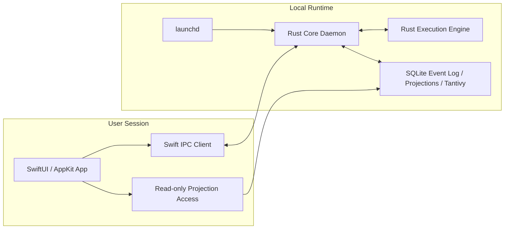
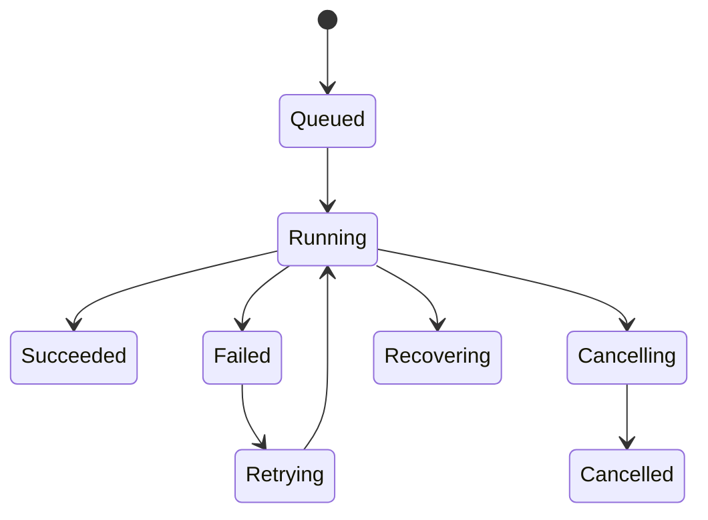

# SwiftUI and Rust Process Communication v0.1

## 1. Goal

Define a communication design between the native macOS UI and the Rust core daemon that is:

- crash-isolated
- low-latency
- explicit in ownership
- recoverable after failure
- suitable for long-running local execution

The UI should remain responsive even when indexing, code generation, git operations, builds, or tests are running.

## 2. Core Decision

Use this process model:

- `SwiftUI/AppKit app` for presentation and user interaction
- `Rust core daemon` as the authoritative local runtime
- `launchd` to supervise daemon lifecycle
- `Unix domain socket + framed Protobuf` as the primary IPC transport
- `read-only local projections` for high-frequency UI reads
- `event subscription stream` for invalidation and live updates

Do not embed the Rust core into the app process through FFI as the primary architecture.

## 3. Why This Design

### Why not direct FFI

- one process means one crash domain
- long-running execution can still impact UI responsiveness
- harder to restart core independently
- harder to evolve daemon protocol as a stable boundary

### Why not XPC as the primary Rust boundary

- XPC is excellent for Apple-native process boundaries, but Rust interoperability is a weaker long-term fit than a simple socket protocol
- protocol ownership becomes less portable if cloud workers or CLI tools later need the same runtime contract

### Why Unix domain socket

- local-only transport
- lower overhead than TCP
- simple permission model
- easy to supervise with `launchd`
- easy to support request/response and streaming on one connection model

## 4. Process Topology

## 5. Ownership Rules

### UI owns

- windows and navigation
- view state
- selection state
- optimistic pending state for user feedback
- rendering of projections

### Daemon owns

- event log
- aggregate writes
- command validation
- workflow side effects
- job scheduling
- execution lifecycle
- sync state
- projection generation

### Shared store rule

The UI may read projection data, but it may never write domain state directly.

That means:

- `writes -> daemon only`
- `reads -> projection store and live subscription`

## 6. IPC Model

### 6.1 Communication Pattern

Use three logical channels:

1. `Command RPC`
   - user intent
   - mutation requests
   - immediate validation result
2. `Query RPC`
   - snapshot reads not served from local projection cache
   - heavy or computed views
3. `Subscription Stream`
   - projection invalidation
   - job status
   - logs
   - notifications for completed background actions

These can be multiplexed over one socket connection or split into dedicated sockets. Start with one authenticated connection that supports stream subchannels.

### 6.2 Message Envelope

Every frame should include:

- `message_id`
- `correlation_id`
- `message_type`
- `schema_version`
- `timestamp`
- `payload`

Every command should include:

- `command_id`
- `actor_id`
- `workspace_id`
- `idempotency_key`

Every event should include:

- `event_id`
- `aggregate_type`
- `aggregate_id`
- `event_type`
- `causation_id`
- `correlation_id`

### 6.3 Serialization Format

Use `Protobuf` for the transport contract.

Reason:

- mature support in both Rust and Swift
- schema evolution is manageable
- compact enough for local IPC
- more maintainable than ad hoc JSON once the command surface grows

Large payloads should not be sent inline if avoidable. Send:

- artifact ids
- file refs
- blob refs
- stream handles

## 7. Read and Write Split

This is the most important performance decision in the desktop client.

### Write Path

1. user action occurs in UI
2. UI sends command to daemon
3. daemon validates command
4. daemon writes domain event
5. daemon updates projections
6. daemon emits subscription update
7. UI refreshes affected views

### Read Path

For common screens, the UI should read from a local read-only projection store:

- task lists
- artifact trees
- requirement summaries
- PRD headers
- job overviews
- release history

The daemon remains the owner of projection writes. The UI opens the projection database in read-only mode.

### Why this split matters

- avoids turning the daemon into a query bottleneck
- keeps high-frequency scrolling and search fluid
- preserves strict write ownership

## 8. Local Storage Layout

Use separate logical stores:

- `events.sqlite`
  - append-only domain events
- `projections.sqlite`
  - UI-facing read models
- `search/`
  - Tantivy indexes
- `blobs/`
  - screenshots, reports, generated docs, artifacts
- `ipc/`
  - socket files and lock files

Suggested root:

- non-sandboxed app:
  - `~/Library/Application Support/com.company.autodev/`
- sandboxed distribution:
  - shared App Group container

## 9. Daemon Lifecycle

### Startup

1. UI launches
2. UI checks daemon health
3. if unavailable, UI asks `launchd` to start or reconnect
4. daemon recovers unfinished jobs from local state
5. daemon replays any necessary projection rebuild steps

### Shutdown

- UI can exit without killing daemon if background work continues
- daemon should support graceful stop for upgrades and maintenance

### Crash Recovery

If daemon crashes:

- `launchd` restarts it
- daemon reopens the event log
- incomplete jobs move to `Recovering` or `FailedRecoverable`
- UI reconnects and re-subscribes
- idempotent commands prevent duplicate writes

## 10. Job Execution Model

Long-running work must never execute on the UI process.

### Job Types

- index workspace
- generate PRD
- generate UI spec proposal
- create worktree
- run code generation
- build
- test
- package release
- sync with cloud

### Job State Machine

The UI should treat jobs as observed entities, not locally managed processes.

## 11. Protocol Surface

The first stable local protocol should expose only a small set of primitives.

### Commands

- `ExecuteCommand`
- `CancelJob`
- `AcknowledgeNotification`
- `RequestDaemonShutdown`

### Queries

- `GetHealth`
- `GetProjectionSnapshot`
- `GetArtifactVersion`
- `GetJobDetails`
- `SearchArtifacts`

### Streams

- `SubscribeProjectionChanges`
- `SubscribeJobUpdates`
- `SubscribeLogOutput`
- `SubscribeNotifications`

Do not expose internal implementation details like raw SQL, raw event tables, or internal scheduler state.

## 12. Swift Client Design

Inside the Swift app, keep a thin client stack:

- `DaemonClient`
  - connection management
  - retries
  - request/response correlation
- `ProjectionRepository`
  - read-only projection access
- `SubscriptionCoordinator`
  - reconnect and re-subscribe logic
- `ViewModel / Observable state`
  - UI-specific mapping only

The app should use structured concurrency:

- one actor for IPC client state
- one actor for subscription lifecycle
- background tasks for heavy projection queries

## 13. Rust Daemon Design

Inside the Rust daemon, separate responsibilities clearly:

- `transport`
  - socket listener
  - frame codec
  - auth and session context
- `command bus`
  - command routing
  - validation
- `event store`
  - append-only event persistence
- `projection engine`
  - read model updates
- `job runner`
  - background execution
- `subscription hub`
  - fan-out to connected UI clients

The daemon should be multi-threaded but deterministic in write ordering per aggregate.

## 14. Concurrency Rules

1. Aggregate writes must be serialized per aggregate id.
2. Projection updates can run asynchronously, but ordering must remain consistent with the event log.
3. Search indexing is eventually consistent.
4. UI subscriptions must tolerate reconnect and replay.
5. Commands must be idempotent.

## 15. Security Model

Because this is local IPC, the main risks are process spoofing, stale sockets, and accidental cross-user exposure.

Rules:

- socket file permissions must be user-restricted
- daemon must verify connecting client session context
- no world-writable socket path
- commands must carry actor and workspace identity
- logs must avoid leaking secrets into UI streams

If privileged operations are later required, introduce a separate helper with its own reviewed boundary. Do not overload the main daemon with privilege escalation responsibilities.

## 16. Error Model

Separate errors into:

- `validation_error`
- `conflict_error`
- `not_found`
- `transient_runtime_error`
- `permanent_runtime_error`
- `daemon_unavailable`
- `subscription_dropped`

The UI should not show raw internal errors directly. It should map them into actionable states:

- retry
- refresh
- inspect conflict
- open logs

## 17. Versioning Strategy

The IPC protocol must be versioned independently from the UI build.

Rules:

- additive fields first
- explicit deprecation windows
- daemon advertises supported protocol versions
- UI negotiates the highest compatible version

This lets the app and daemon evolve without forcing lockstep internals forever.

## 18. Final Recommendation

For this system, the best communication design is:

- `SwiftUI app` as a thin native shell
- `Rust daemon` as the authoritative local runtime
- `launchd` for supervision
- `Unix domain socket + Protobuf` for IPC
- `read-only projection store` for UI reads
- `event subscription stream` for live updates

This design gives the cleanest balance of:

- decoupling
- crash isolation
- performance
- protocol stability
- long-term maintainability
